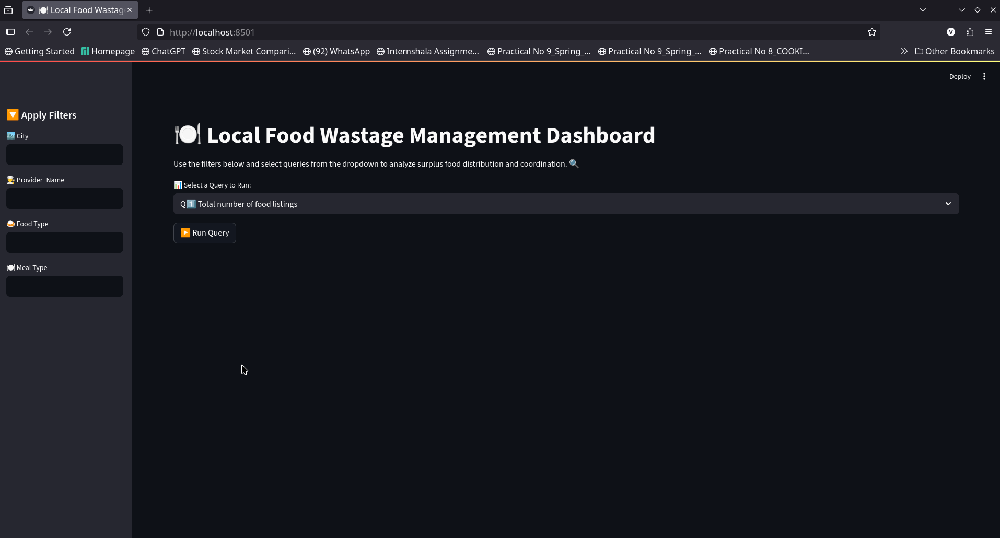
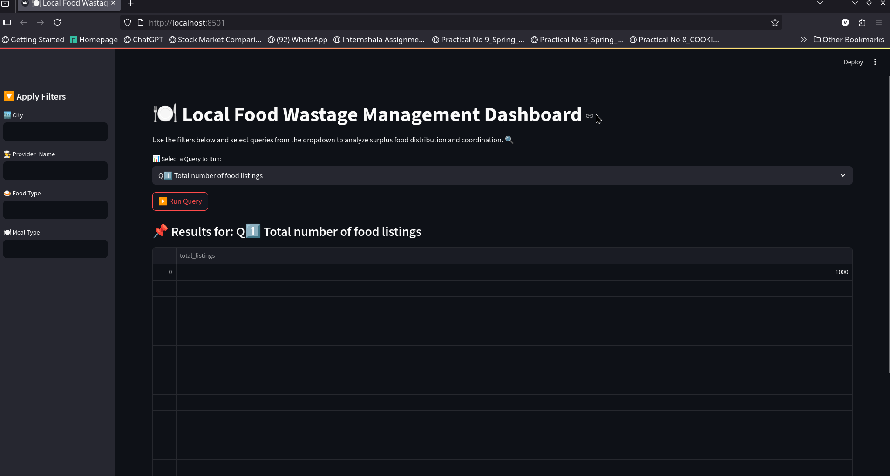
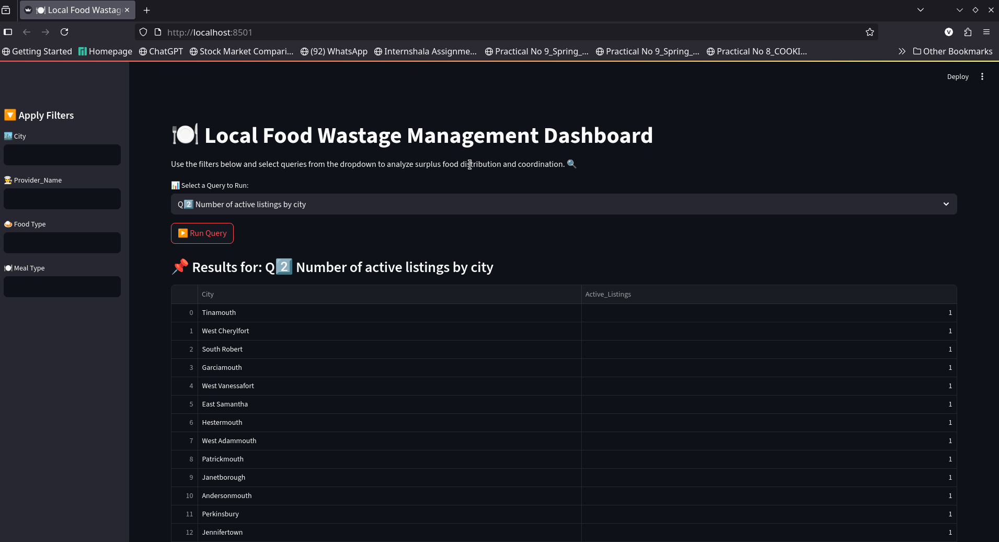

# 🍲 Local Food Wastage Management System

-🚀 A data-driven web application built with Streamlit + MariaDB + Python to reduce food wastage by connecting surplus food providers (restaurants/individuals) with receivers (NGOs/individuals).
-The system supports real-time surplus listing, matching, analytics, and provider–receiver coordination.

## 📌 Problem Statement
-Food wastage is a critical issue 🌍. Restaurants, individuals, and events often dispose of surplus food, while NGOs and needy communities face shortages.
This project provides a digital bridge between providers and receivers, ensuring surplus food is redistributed efficiently, reducing waste, and supporting sustainability.

# ⚙️ Tech Stack

-🐍 Python 3.9+

-🎈 Streamlit (Interactive UI)

-🗄️ MariaDB (Database)

-🐼 Pandas / Numpy (Data handling)

-📊 Matplotlib / Plotly (Visualizations)

-📝 SQLAlchemy / mariadb-connector-python (DB connection)


# 📂 Dataset Details

-Uploaded CSVs are used to populate MariaDB tables.

🍱 Food Listings (food_listings_data.csv)

-Listing_ID, Provider_ID, Food_Type, Quantity, Expiry_Date, City, Meal_Type, Status

🏢 Providers (providers_data.csv)

-Provider_ID, Name, Contact, City, Provider_Type

🙋 Receivers (receivers_data.csv)

-Receiver_ID, Name, Contact, City, Food_Type_Preference, Capacity

📑 Claims (claims_data.csv)

-Claim_ID, Listing_ID, Receiver_ID, Claim_Date, Status


# 📊 Dashboard Features

🔎 The Streamlit app provides 15 SQL-driven analytics & insights:

1️⃣ Total number of food listings

2️⃣ Active listings by city

3️⃣ Top 5 most frequent food types

4️⃣ Count of listings expiring today

5️⃣ Provider-wise listing count

6️⃣ City-wise distribution of providers

7️⃣ Receiver capacity by city

8️⃣ Match listings with receivers (city + food type)

9️⃣ Total surplus quantity by city

🔟 Meal type distribution

1️⃣1️⃣ List expired food listings

1️⃣2️⃣ Listings per provider type

1️⃣3️⃣ Avg. quantity per food type

1️⃣4️⃣ Providers & Receivers count by city

1️⃣5️⃣ Provider contact details (📞 displayed in bullet points with emojis)


# 📸 Screenshots
🏠 Home Dashboard



📊 Query Results Example

1️⃣ Total Listings 🧾



2️⃣ Active Listings by City 🏙️




# 🎯 Real-World Use Cases

✅ Restaurants & Hotels can reduce food waste

✅ NGOs & Charities can access surplus food quickly

✅ Local Governments can track wastage trends for policy decisions

✅ Communities benefit from reduced hunger & sustainable practices


# 🛠️ Installation & Setup

### 1. Clone repo 

```bash
git clone https://github.com/GeekyVishweshNeelesh/Food_management_project_Data_Science

cd food_wastage_management
```

### 2. Install dependencies

```bash 
pip install -r requirements.txt
```

### 3. Setup MariaDB

```bash
mariadb -u root -p

CREATE DATABASE food_wastage_db;

USE food_wastage_db;
```

### 4.Load CSV data into MariaDB

```bash
python load_data.py
```

### 5.Run Streamlit app

```bash
streamlit run app.py
```


# 🤝 Contributors

👨‍💻 Vishwesh Neelesh


